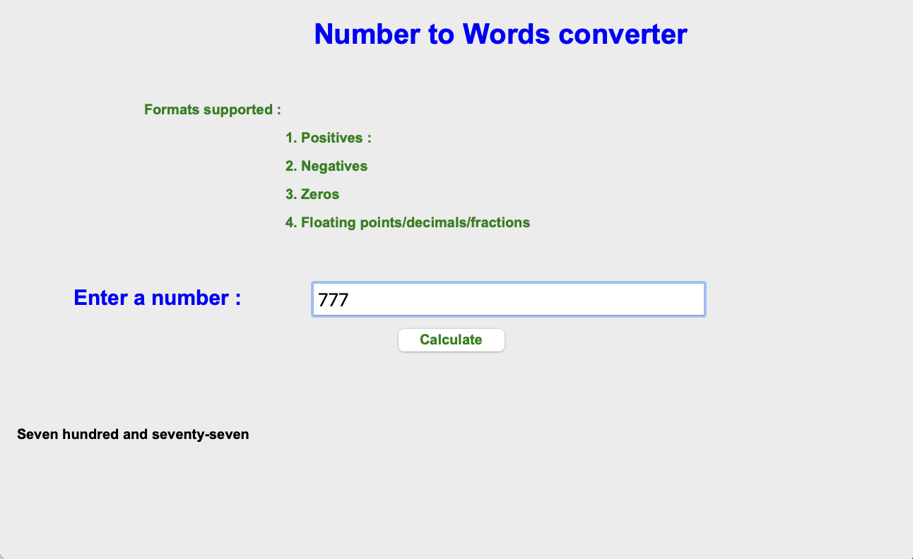

# Number to Words Converter



A Python desktop application that converts numbers into words using the `num2words` library and Tkinter.

## Table of Contents

- [Description](#description)
- [Features](#features)
- [Getting Started](#getting-started)
  - [Prerequisites](#prerequisites)
  - [Installation](#installation)
- [Usage](#usage)
- [Contributing](#contributing)
- [License](#license)

## Description

This application provides a user-friendly graphical interface for converting numerical values into their word representations. It is built with Python and Tkinter for the GUI, and the conversion is done using the `num2words` library, which supports various formats, including positive numbers, negative numbers, zeros, and floating-point numbers.

## Features

- Converts numerical values into words.
- Supports various formats, including positive numbers, negative numbers, zeros, and floating-point numbers.
- User-friendly graphical interface.
- Cross-platform compatibility (Windows, macOS, Linux).

## Getting Started

### Prerequisites

Before you begin, ensure you have met the following requirements:

- Python (3.x recommended)
- `num2words` library

### Installation

1. Clone the repository:

   ```shell
   git clone https://github.com/SharnellGraham/Num2words.git
Change to the project directory:

```shell
Copy code
cd Num2words
Install the required dependencies (if not already installed):

 ```shell
Copy code
pip install num2words
Usage
Run the application:

```shell
Copy code
python num-to-words.py
Enter a numerical value in the input field.

Click the "Calculate" button to convert the number to words.

The result will be displayed below the input field.

Contributing
Contributions are welcome! If you'd like to contribute to this project, please follow these steps:

Fork the repository.

Create a new branch for your feature or bug fix:

```shell
Copy code
git checkout -b feature/my-feature
Commit your changes and push them to your fork:

```shell
Copy code
git commit -am 'Add new feature'
git push origin feature/my-feature
Create a pull request on the main repository.

License
This project is licensed under the MIT License - see the LICENSE file for details.

